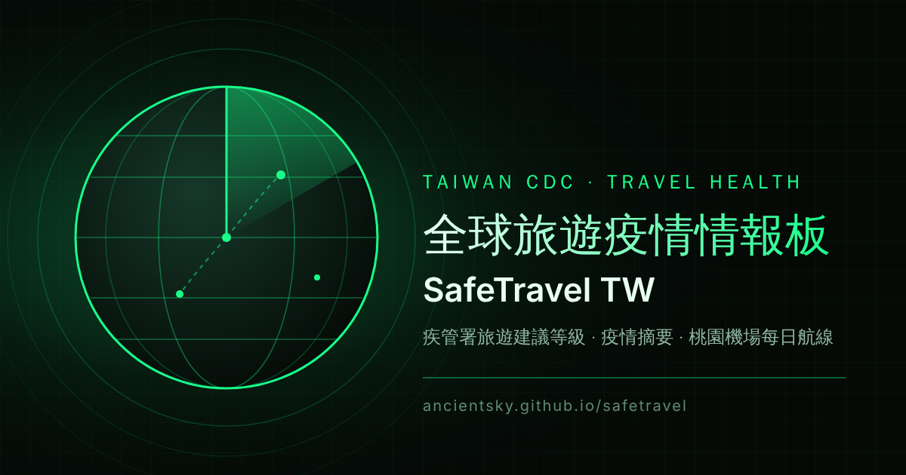
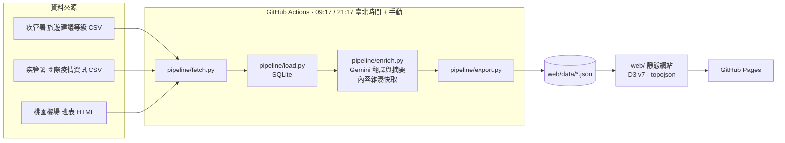

# SafeTravel TW · 全球旅遊疫情情報板

**Live site / 線上網站:** https://ancientsky.github.io/safetravel/  <!-- placeholder: replace after first Pages deploy -->



---

## 繁體中文

### 這是什麼

SafeTravel TW 是一個靜態網站（GitHub Pages），把臺灣疾病管制署（疾管署）發布的「國際旅遊疫情建議等級」與「國際重要疫情資訊」整理成一張可互動的世界地圖與疫情摘要：

- **旅遊建議等級地圖**：依各國最高等級（第一級注意、第二級警示、第三級警告）上色，點擊國家可看到所有有效建議。
- **近兩年疫情摘要**：疾管署的國際疫情資訊經 Google Gemini 翻譯為英文，並產生單則摘要與各國兩年總覽（中英對照）。
- **桃園機場每日航線動畫**：以桃園國際機場（TPE）當日出發與抵達的目的地，在地圖上以動態弧線呈現。

網站每日自動更新兩次（臺北時間 09:17 與 21:17），採用深色（黑綠）與淺色主題，介面支援繁體中文與英文。

### 架構



```
 GitHub Actions (cron 2×/day + manual)
   fetch  →  data/raw/*.csv, data/raw/flights/*
   load   →  data/safetravel.db   (SQLite, 歷史與 Gemini 快取)
   enrich →  Gemini：翻譯 + 摘要（無金鑰時降級為中文，ai:false）
   export →  web/data/*.json      (資料格式見 docs/DATA_CONTRACT.md)
   commit + deploy  →  GitHub Pages
```

詳細設計請見 [docs/ARCHITECTURE.md](docs/ARCHITECTURE.md) 與 [docs/DATA_CONTRACT.md](docs/DATA_CONTRACT.md)；維運操作請見 [docs/OPERATIONS.md](docs/OPERATIONS.md)。

### 資料來源

| 資料 | 來源 |
|------|------|
| 國際旅遊疫情建議等級（全歷史） | 疾管署 `CountryEpidLevel/ExportCSV`（[ARCHITECTURE.md 的完整網址](docs/ARCHITECTURE.md#data-sources)） |
| 國際重要疫情資訊（約兩年） | 疾管署 `TravelEpidemic/ExportCSV`（同上） |
| 桃園機場每日班表 | <https://www.taoyuan-airport.com/flight_timetable?lang=en> |
| 機場座標 | [OpenFlights `airports.dat`](https://openflights.org/data.html) |
| 世界地圖幾何 | [world-atlas](https://github.com/topojson/world-atlas)（50m） |
| 國家代碼、中英名稱、中心點 | [world-countries](https://github.com/mledoze/countries) |
| 前端函式庫 | [D3 v7](https://d3js.org/)、[topojson-client](https://github.com/topojson/topojson-client)（已 vendor 至 `web/vendor/`） |

### 旅遊建議等級如何計算

1. **每筆公告只是一列紀錄。** 目前狀態為 `(疾病, ISO 代碼, 行政區)` 的最新一列；若最新一列為「解除」，該建議即失效，不顯示。
2. **COVID-19 的舊名稱不計入。** 「嚴重特殊傳染性肺炎」整個捨棄；只計入疾管署 2023-11-01 改名後的「新冠併發重症」。
3. **全球背景建議不上色。** 若某疾病在 150 個以上國家同一等級（目前只有「新冠併發重症」第一級），以頁面註腳顯示，不影響地圖顏色與各國最高等級。
4. **國家等級取最高值。** 含次級行政區（例如中國大陸的北京市），國家等級為所有有效列的最大值（第一至第三級）。
5. **代碼處理。** Namibia 的 ISO 代碼為 `NA`，讀取時必須保留字串（不可被當成空值）。沒有代碼的地區以 `data/manual/territories.json` 對應；對應不到者列在「未對應」區塊。索馬利蘭（`SMLL`）屬於未對應。

### 本機開發

```bash
pip install -r pipeline/requirements.txt
python -m pipeline run --offline          # 只使用 data/raw/ 的離線樣本，不連網、不呼叫 Gemini
python -m pipeline run                    # 完整執行（通常在 GitHub Actions 執行）
python -m pipeline export                 # 由 SQLite 重新匯出 JSON
python pipeline/build_geo.py              # 重建 web/data/world.json、airports.json、countries.json
python -m http.server -d web 8080         # 預覽網站：http://localhost:8080/
```

前端無需建置步驟。若要更新前端函式庫，執行 `npm install && npm run vendor`。
執行冒煙測試（需先啟動預覽伺服器與安裝 Chromium）：

```bash
npm install
npx playwright install chromium           # 本機第一次使用才需要
node tests/smoke.mjs http://localhost:8080/
```

### GitHub 設定檢查清單

- [ ] **Secrets**：Settings → Secrets and variables → Actions → New repository secret，名稱 `GEMINI_API_KEY`，填入 Gemini API 金鑰。（未設定時資料仍會更新，只是不翻譯、不產生摘要。）
- [ ] **Variables（選填）**：同一頁的 Variables 新增 `GEMINI_MODEL`。未設定時預設為 `gemini-3.5-flash`。
- [ ] **Pages**：Settings → Pages → Build and deployment → Source 選 **GitHub Actions**。
- [ ] **Workflow 權限**：Settings → Actions → General → Workflow permissions 需允許讀寫（`update-data.yml` 會 commit 更新後的資料）。
- [ ] **手動執行**：Actions → `update-data` → Run workflow，可立即更新資料。
- [ ] **排程**：`update-data.yml` 每日 09:17 與 21:17（Asia/Taipei）執行（cron 為 UTC `17 1,13 * * *`）。

### 免責聲明

本網站為非官方的資料整理與視覺化專案，**不構成醫療建議**。旅遊健康相關決策請以**臺灣疾病管制署（官方來源：<https://www.cdc.gov.tw/>）**及當地主管機關公告為準。AI 翻譯與摘要可能有誤，請以原文為準。資料可能因來源延遲或格式變更而不完整。

### 授權

- **程式碼**：MIT License，詳見 [LICENSE](LICENSE)。
- **資料**：疾管署資料依[政府資料開放授權條款](https://data.gov.tw/license)使用，著作權屬臺灣疾病管制署所有（© Taiwan CDC）。使用時請標示來源與資料時間。
- **第三方資料**：OpenFlights、world-atlas、world-countries 等依其各自授權條款使用。

---

## English

### What is this

SafeTravel TW is a static GitHub Pages site that turns the Taiwan CDC (TCDC) international travel-health data into an interactive dashboard:

- **Travel advisory map**: countries coloured by their highest current advisory level (Level 1 Watch, Level 2 Alert, Level 3 Warning). Click a country to see every active advisory.
- **Two-year epidemic digest**: TCDC's international epidemic notices, translated to English and summarised by Google Gemini, plus a per-country two-year overview (zh and en).
- **Daily Taoyuan Airport routes**: animated arcs from Taiwan Taoyuan International Airport (TPE) to the destinations served that day.

The data refreshes automatically twice a day (09:17 and 21:17, Asia/Taipei). The interface is bilingual (zh-Hant default, English) with dark (default) and light themes.

### Architecture

See the Mermaid diagram above. In short: GitHub Actions fetches the sources, stores history in SQLite, enriches epidemic items with Gemini (cached by content hash), exports JSON into `web/data/`, commits, and deploys `web/` to GitHub Pages. The frontend is vanilla JavaScript ES modules with D3 v7 and topojson-client vendored in `web/vendor/`; there is no build step.

Full design: [docs/ARCHITECTURE.md](docs/ARCHITECTURE.md) · JSON contract: [docs/DATA_CONTRACT.md](docs/DATA_CONTRACT.md) · Runbook: [docs/OPERATIONS.md](docs/OPERATIONS.md).

### Data sources

| Data | Source |
|------|--------|
| International travel alert levels (full history) | TCDC `CountryEpidLevel/ExportCSV` (full URLs in [ARCHITECTURE.md](docs/ARCHITECTURE.md#data-sources)) |
| International epidemic digest (~2 years) | TCDC `TravelEpidemic/ExportCSV` (same) |
| Taoyuan Airport daily timetable | <https://www.taoyuan-airport.com/flight_timetable?lang=en> |
| Airport coordinates | [OpenFlights `airports.dat`](https://openflights.org/data.html) |
| World geometry | [world-atlas](https://github.com/topojson/world-atlas) (50m) |
| Country codes, names, centroids | [world-countries](https://github.com/mledoze/countries) |
| Front-end libraries | [D3 v7](https://d3js.org/), [topojson-client](https://github.com/topojson/topojson-client) (vendored in `web/vendor/`) |

### How advisory levels are computed

1. **Each CSV row is one announcement.** The current state is the latest row for each `(disease, ISO code, sub-area)` key. If that latest row is a lifting notice (解除), the advisory is dropped.
2. **The retired COVID-19 name is excluded.** Every row of 嚴重特殊傳染性肺炎 is discarded; only 新冠併發重症 (since 2023-11-01) counts.
3. **Global background is not coloured.** A disease applied at the same level to 150 or more countries (currently 新冠併發重症 Level 1) is shown as a footnote and does not affect map colours or a country's maximum level.
4. **A country takes its maximum level**, including sub-national rows (for example Beijing under China).
5. **Codes.** Namibia's ISO code is `NA`; it must be read as a string, never as null. Territories without a code are mapped via `data/manual/territories.json`; anything still unmatched (for example Somaliland, `SMLL`) is listed under "unmapped".

### Local development

```bash
pip install -r pipeline/requirements.txt
python -m pipeline run --offline          # offline fixtures only; no network, no Gemini
python -m pipeline run                    # full run (normally GitHub Actions)
python -m pipeline export                 # re-export JSON from SQLite
python pipeline/build_geo.py              # rebuild web/data/world.json, airports.json, countries.json
python -m http.server -d web 8080         # preview at http://localhost:8080/
```

To refresh vendored front-end libraries: `npm install && npm run vendor`.
Smoke test (server must already be running; Chromium needed):

```bash
npm install
npx playwright install chromium           # first time only
node tests/smoke.mjs http://localhost:8080/
```

### GitHub setup checklist

- [ ] **Secret**: Settings → Secrets and variables → Actions → New repository secret named `GEMINI_API_KEY`. Without it the pipeline still runs, but epidemic items are not translated or summarised (`ai: false`).
- [ ] **Variable (optional)**: add `GEMINI_MODEL` under Variables. Defaults to `gemini-3.5-flash`.
- [ ] **Pages**: Settings → Pages → Build and deployment → Source: **GitHub Actions**.
- [ ] **Workflow permissions**: Settings → Actions → General → Workflow permissions must allow read and write (the update workflow commits refreshed data).
- [ ] **Manual run**: Actions → `update-data` → Run workflow.
- [ ] **Schedule**: `update-data.yml` runs at 09:17 and 21:17 Asia/Taipei (cron `17 1,13 * * *` in UTC).

### Disclaimer

This is an unofficial visualisation of public data. **It is not medical advice.** For health-related travel decisions, rely on the **Taiwan CDC (official source: <https://www.cdc.gov.tw/>)** and local authorities. AI translations and summaries may contain errors; the original text prevails. Data may be incomplete or delayed due to upstream publication or format changes.

### Licence

- **Code**: MIT License, see [LICENSE](LICENSE).
- **Data**: TCDC data is used under the Taiwan [Open Government Data License](https://data.gov.tw/license); copyright © Taiwan Centers for Disease Control. Please credit the source and the data date when reusing it.
- **Third-party data**: OpenFlights, world-atlas, world-countries and other dependencies are subject to their own licences.
